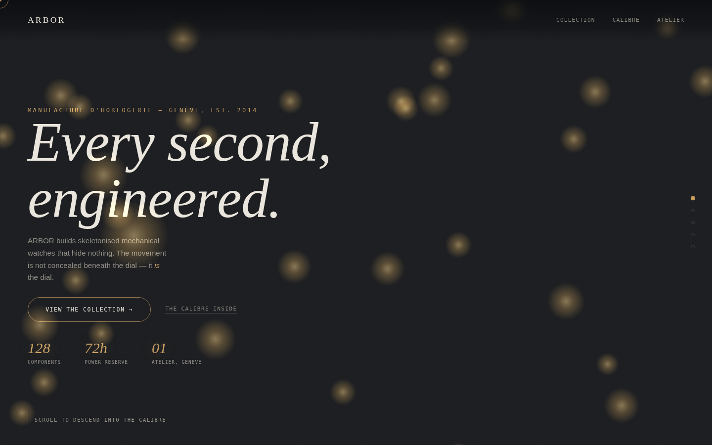

# Arbor


A premium, awwwards-style landing page for **ARBOR**, a fictional Geneva skeleton-watch manufacture — built as a design/front-end showcase piece.

**Live:** https://anatolilavra-droid.github.io/arbor/



## Concept

Scrolling drives a single WebGL camera move straight through the physical layers of a watch — crystal, dial, hands, movement, caseback — instead of scrolling past flat sections. Each depth stop syncs a Three.js layer (an animated gear train with hand-built extruded gear geometry, a balance wheel, hour markers) to a content panel that crossfades in as the camera arrives. A live seconds hand on the collection dials ticks against the real clock.

## What it demonstrates

- Scroll-scrubbed camera animation through a 3D scene (single progress value drives camera depth, panel opacity, and per-layer 3D visibility)
- Procedural gear geometry built from `THREE.Shape` + `ExtrudeGeometry`, no modeled assets
- GSAP-driven preloader, split-character hero title reveal, magnetic CTA buttons, custom cursor
- `prefers-reduced-motion` and reduced-motion/mobile particle-count fallbacks throughout
- Fully self-contained single `index.html` — no build tooling, no bundler

## Stack

Plain HTML/CSS + Three.js (vendored, via import map) + GSAP/ScrollTrigger (vendored). No CDN dependency — `vendor/` ships the exact library builds the page needs, so it works offline and isn't affected by a CDN outage. Fonts load from Google Fonts (Instrument Serif, Instrument Sans, Fragment Mono).

## Run locally

```bash
npx serve .
# or just open index.html directly in a browser
```

## Deploy

Pushing to `main` runs [`.github/workflows/deploy.yml`](.github/workflows/deploy.yml), which publishes the site to GitHub Pages automatically.

## License

MIT — see [LICENSE](LICENSE).
